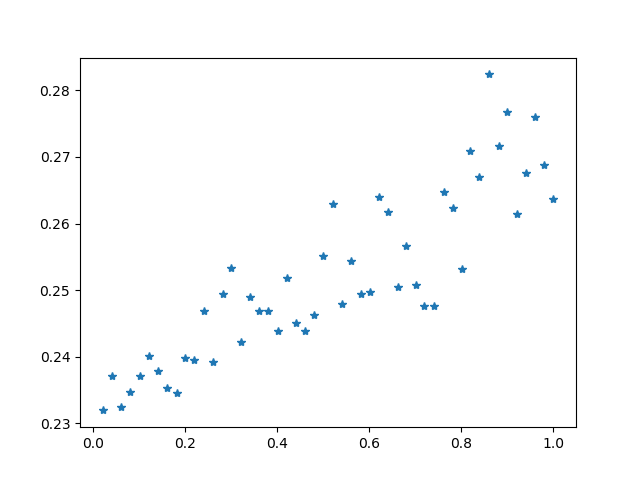
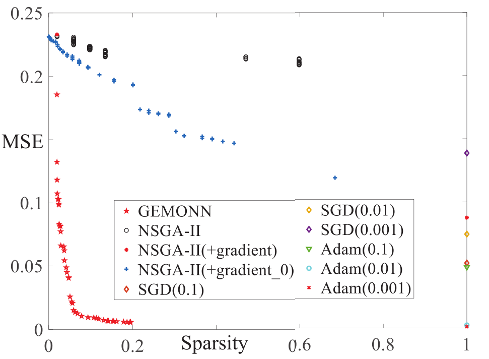
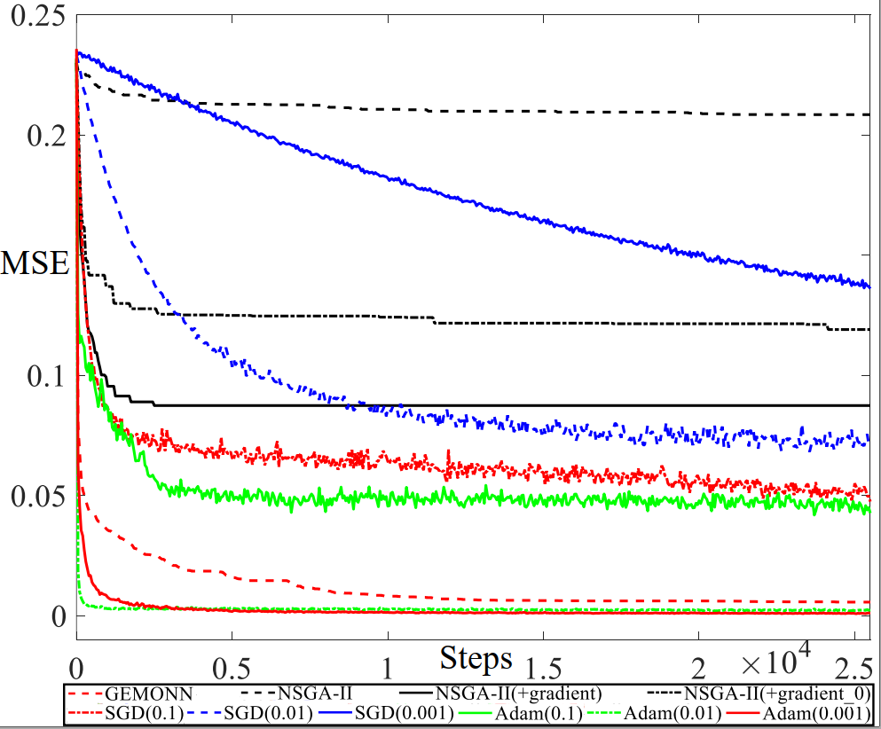
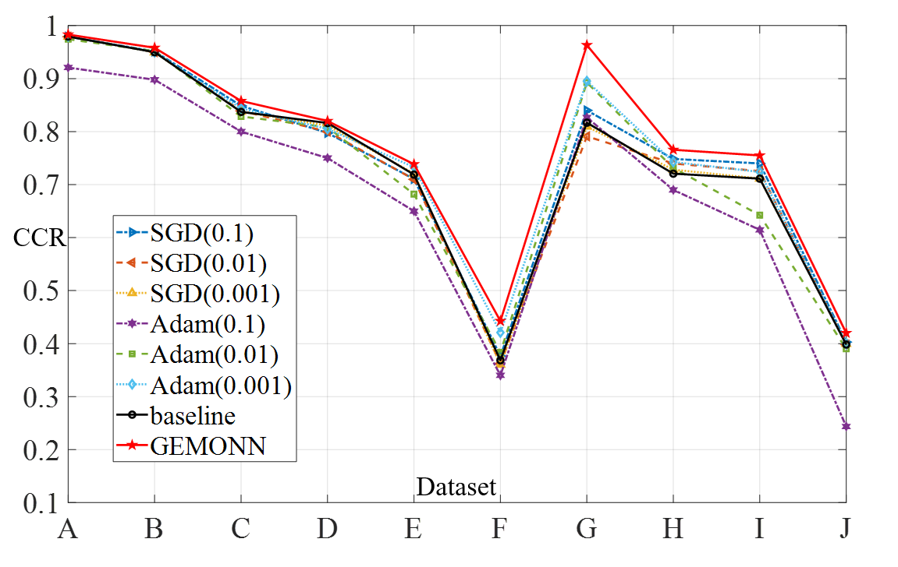
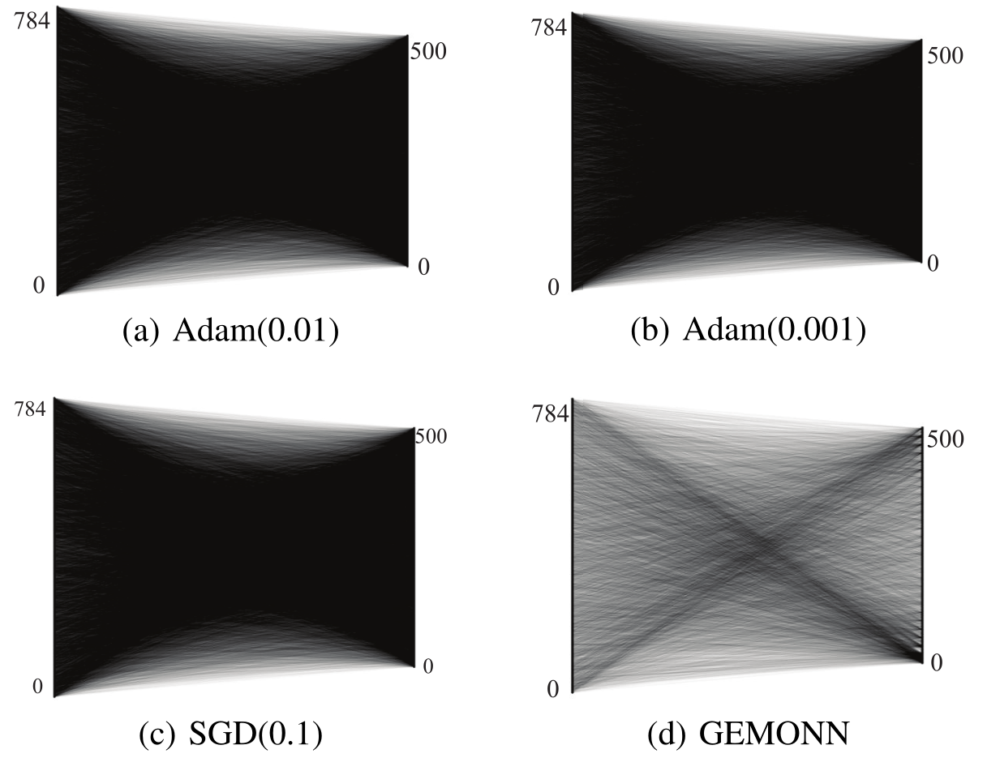
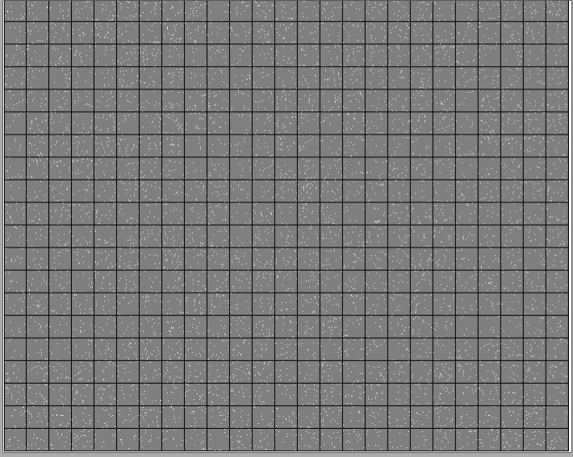
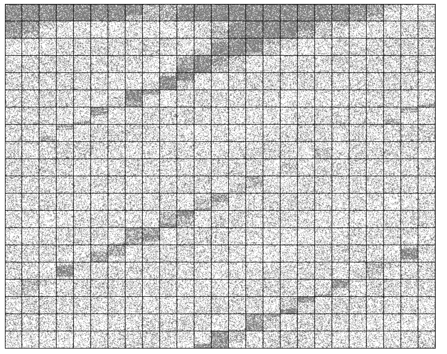
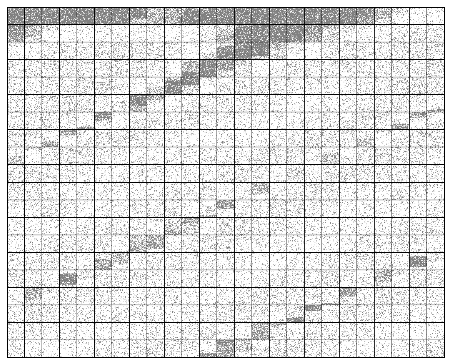
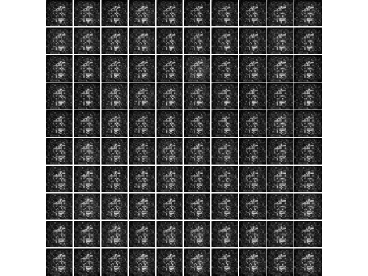
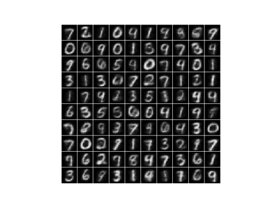

# GEMONN

## Introduction
This the source code of GEMONN *A Gradient Guided Evolutionary Approach to Training Deep Neural Networks*

## Requirements and  Dependency
```bash
torch>=1.4.0
torchvision >=0.5.1
cuda 10.0
cupy
numpy
matplotlib
```
## Usage
```bash
python Main.py
python Main.py --Generations 500 --Popsize 50 --HiddenNum 500 --plot  --save --save_dir ./result
```
## Result 
 #### This is the results of Auto-Encoder (AE) with sinlge hidden layer on MNIST results: the x-axis is MSE loss, and the y-axis is the sparsity in term of L0-norm

Initial result: 


Result after evolution: 


Final results:


 #### Next, the comparison of  final solutions obtained by GEMONN, SGD, Adam, and NSGA-II vatiants on MNIST is shown in the MSE-Sparsity axis as follows:



#### Then, the convergence spped of GEMONN and these compared approaches in terms of the decline in MSE are presented (MNIST):



#### The following figure shows the test CCR values (accuracy) of the models on ten datasets, which tail a classifier  to the hidden layer of the AE:


 #### In the following,  the comparison of final solution in terms of sparsity is given:
 

 #### The sparsity obtained by GEMONN in different generation(1st, 10th, 100th, and 500th):

 <div align="center">



 </div>


 <div align="center">




 </div>


#### The reconstruction image of the optimal solution obtained by GEMONN in different generation:

 

 
 <div align="center">





 </div>


## Extension on more models
For training more models such as LSTM and CNNs, there are guidance  in  `Private_function.py` :

1) Get your model in pytorch
```bash
Model = LeNet()
```
2) Get the weights dictionary of model :
```bash
 Parameter_dict = Model.state_dict()
```
3) Initialize the population and obtain corresponding size and length inforamtion of weighs in different parts of the model :
```bash
 Population, Boundary, Coding, SizeInform, LengthInform = Initialization_Pop_(PopSize =10, Model = Model)
```
4) Obtain the weights dictionary of each individual in population and compte the inference loss for evaluation:
```bash
 Parameter_dict_i = Pop2weights(Population[0], SizeInform, LengthInform, Parameter_dict)
 Model.load_state_dict(Parameter_dict_i)
```
5) Train this model by GEMONN supported by sparse-SGD or spare-Adam


